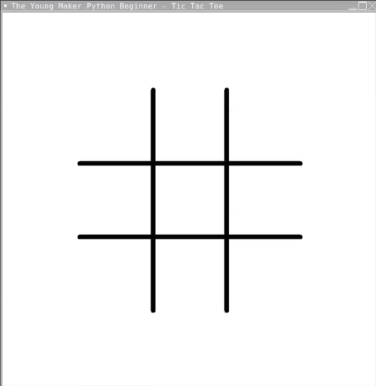

# TicTacToe
Introducing Turtle Tic Tac Toe, a fresh spin on the classic game of strategy and wit, developed using the Turtle graphics library. This engaging game features an interactive interface where players take turns to mark spaces in a 3x3 grid, aiming to line up three of their marks either vertically, horizontally, or diagonally.

The game leverages the Turtle library, known for its ease of use and ability to create graphical applications, resulting in a visually appealing gameboard that draws players into the strategic battle. The simplicity of the design adds a nostalgic touch while the underlying programming provides a seamless and enjoyable gameplay experience.

Turtle Tic Tac Toe also features an intuitive user interface, where players mark their spots simply by clicking on the desired square in the grid. Whether you are a seasoned Tic Tac Toe veteran or a new player, this game promises to provide an engaging and strategic challenge.

# Demo

